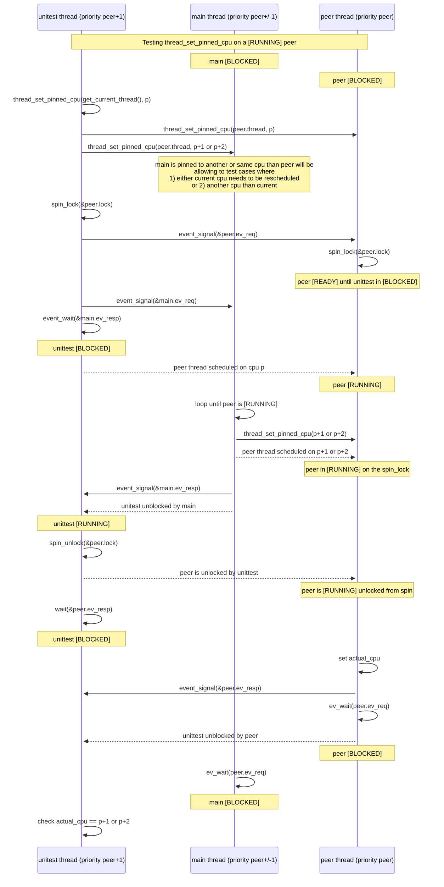
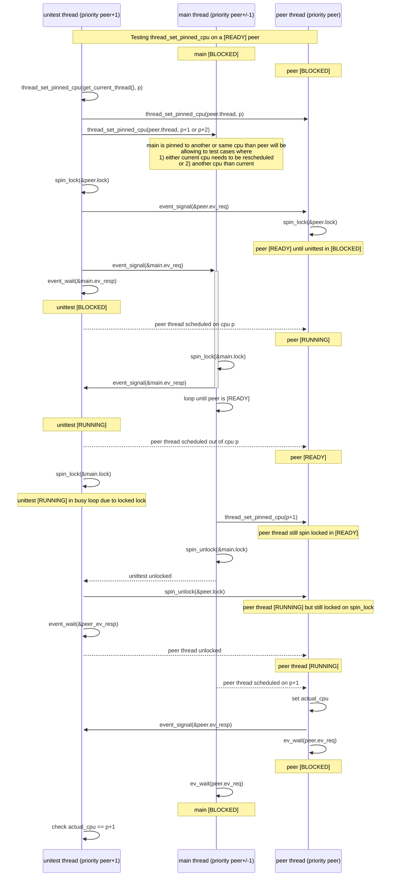
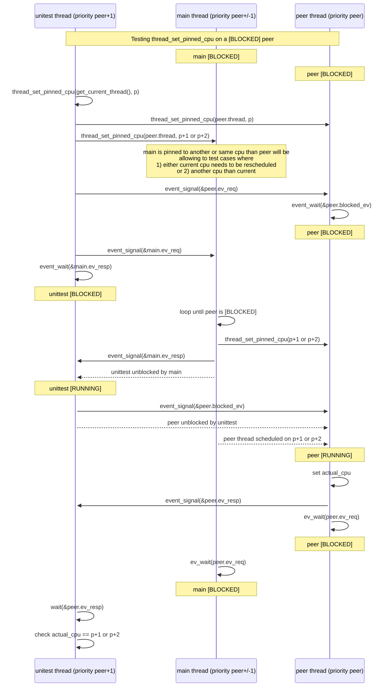
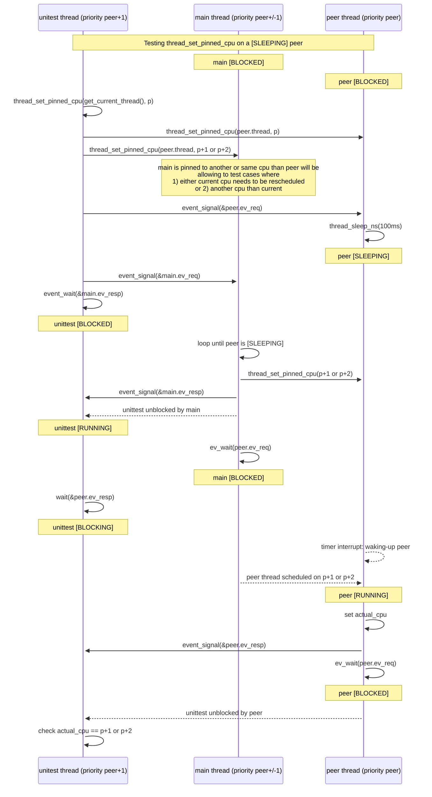

`pincputest` shall verify that a peer thread being pinned to a new cpu is
rescheduled properly; particular attention shall be given to situations
where the thread can be rescheduled right away.

In order to cover all cases, the test shall ensure that the peer thread
rescheduling happens:
1. in any possible state of the peer thread (running, ready, blocked, sleeping),
2. whether the newly pinned cpu is the current cpu or another cpu
3. whether the thread from which the peer thread is pinned is a higher
   or lower priority than the peer thread
4. and finally whether the involved threads are standard or real-time threads.

Note: the real-time threads are not collaboratively time-sliced with other threads
on their current cpu. This implies that a real-time thread will have to become
BLOCKED or SLEEPING before it can be interrupted.

In order to be able to set the peer thread in a given state, we need to use
a control thread with same or higher priority than the peer thread.
This control thread will be the `unittest thread`. The thread responsible
for pinning the `peer` thread is called the `main` thread.

Below sections illustrates the interactions between the `unittest` thread, the `main` thread and the `peer` thread to reach the expected `peer` thread state in the various
cases described above.

## Testing `thread_set_pinned_cpu` on a `[RUNNING]` peer

## Testing `thread_set_pinned_cpu` on a `[READY]` peer

## Testing `thread_set_pinned_cpu` on a `[BLOCKED]` peer

## Testing `thread_set_pinned_cpu` on a `[SLEEPING]` peer

